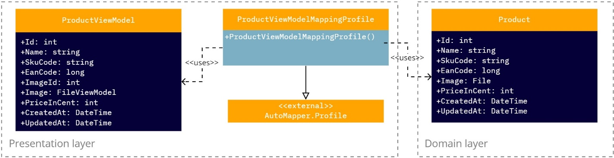
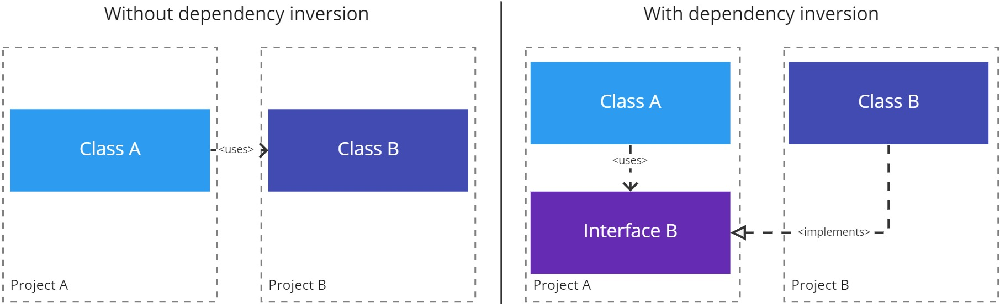
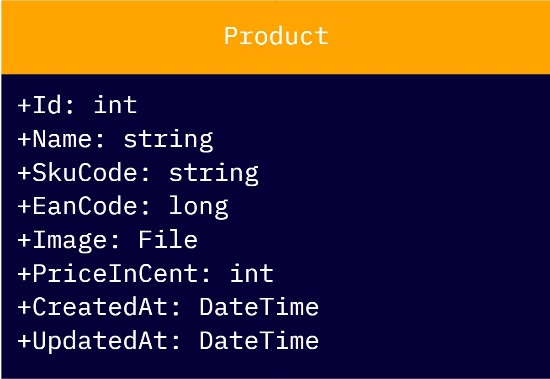
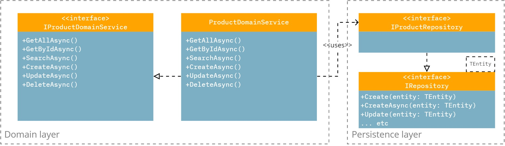
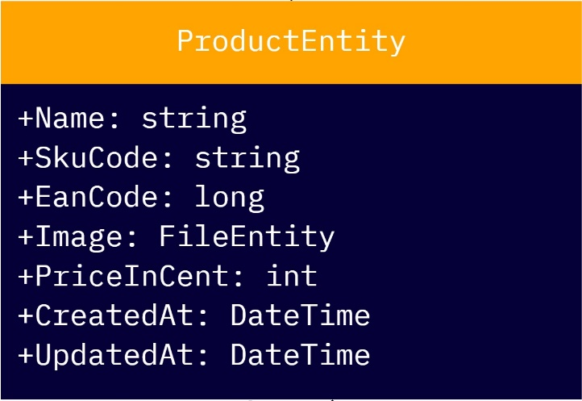
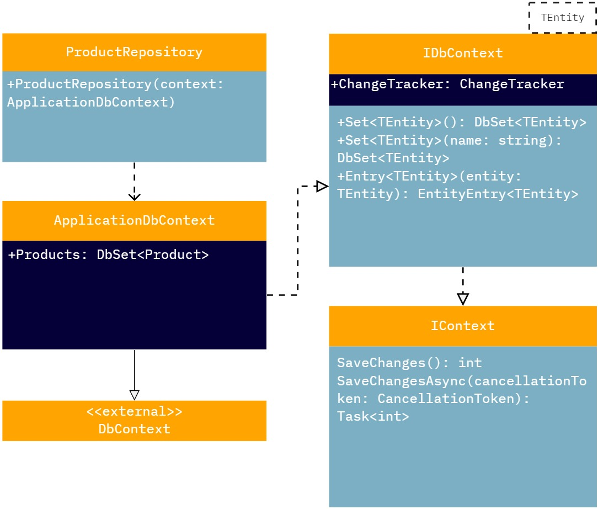

# Architectural design

This project implements the N-tier layered architecture and in this case consists of three layers, namely: presentation,
domain and persistence layer. The architecture works like a waterfall from top to bottom, with the presentation layer at
the top and the persistence layer at the bottom. The advantage of this architecture is that each layer has its own
responsibilities. The architecture ensures the right control in the right places and shields and enforces those
responsibilities.

## Table of contents

- General principles and processes
    - Mapping
    - Dependency inversion
- Layers
    - Presentation
        - Startup (ASP.NET Core)
    - Domain
        - Domain models
        - Domain services
    - Persistence
        - Entity models
        - Repositories
        - Migrations
- Projects
    - Projects per layer
        - Abstractions
        - Implementation
        - Tests
            - Mocking
    - Inversion of Control (IoC)
    - Supporting projects
        - Common

## General principles and processes

In this chapter general principles and processes are explained. These principles and processes are used throughout the
architecture and are necessary to ensure code quality.

### Mapping

Mapping is used to move data through adjacent layers. In this process, certain data is transferred from one data model
to another data model. This is done to prevent the data models from one layer from being leaked to another layer in the
architecture.

In the current state of the project, the “AutoMapper” library is used to make this process easier.

The image above shows the setup of an AutoMapper profile. In this profile, the connection between two particular data
models is configured. Here you can also choose not to show certain properties or to add extra properties.

### Dependency inversion

The dependency inversion principle is used for calling a dependency in a certain layer. In this principle, the
dependencies are disconnected using interfaces. In this way, the implementation/logic of dependency is not called
directly, but only through its interface. Advantages for this are:

- Easily attach or detach from dependency implementation/logic
- Easier to unit test classes with dependencies
- Improved the readability of the classes, constructors are not filled with unnecessary logic

The diagram above describes a connection between the domain and the persistence layer of the project. In this diagram,
the dependency inversion principle is followed to make the connection loosely coupled. As a result, the
“ProductDomainService” does not have strong links to the persistence layer.

All in all, the quality and testability of the code improves. The application of this principle is demonstrated further
in the document.

## Layers

As described at the beginning of this chapter, the architecture currently consists of three different layers, namely:

- Presentation
- Domain
- Persistence

This chapter explains the specific function of each layer.

### Presentation

The presentation layer is the highest layer in the architecture and can be thought of as the connector on the domain
layer. It is therefore possible to have multiple projects within the presentation layer, such as a REST API or an MVC
application. These live in the same layer, but have different projects. The presentation layer gives the possibility to
use these projects as plug-ins on the domain layer.

#### Startup (ASP.NET Core)

ASP.NET Core applications use a Startup class, which by convention is called Startup. The Startup class:

1. Optionally includes a “ConfigureServices” method to configure the services of the app. A service is a reusable
   component that provides app functionality. Services are registered in “ConfigureServices” and used in the application
   via dependency injection (DI).
2. Contains a “Configure” method to create the request pipeline of the app.

When the app is started, the “ConfigureServices” and “Configure” methods are called by the ASP.NET Core runtime.

### Domain

The domain layer, also known as the company/business layer, consists of concepts involved with the company and rules
that the company uses with regard to that data.

#### Domain models

During the elaboration of the conceptual model, domain models were created. The image above shows an example domain
model in the form of a UML class diagram.

Domain models are a representation of meaningful concepts that exist in the real world for the domain. These concepts
must be modeled in software. The concepts include the data involved in the business and rules that the business uses
regarding that data. A domain model thus uses the natural language of the domain.

#### Domain services

The domain services contain the business logic that makes the application work according to the business rules. The
image above shows a domain service classes with their associated interface and repository dependency. This diagram also
shows the use of the dependency inversion principle.

### Persistence

The persistence layer is the lowest and deepest layer of the project. This layer consists of everything that has to do
with data storage, for example entity models, repositories and migrations. Adding this layer isolates the application
from the specific data storage method(s) (e.g. database engine). This has several advantages, including:

- Easier migration to other storage engines
- Better limiting database logic
- Easier to replace or modify database logic

#### Entity models

The image above shows an example of an entity model in the form of a UML class diagram.

A conscious choice has been made to use explicit entity classes rather than directly using the domain models as
entities. The advantage of this is that: in this way a distinction can easily be made between what is stored in the
database and what is described in the domain models.

#### Repositories

In the persistence layer, a repository is created per entity. In the image above, an example of a repository, including
its dependencies, is shown in the form of a UML class diagram. These repositories originate from the so-called
“repository pattern”, the advantages of this pattern are:

- The domain logic can be unit tested without calling the database logic
- The database logic becomes reusable
- The database logic is managed centrally, making it easy to implement support functionality for the databases, such as
  caching
- It's easier to implement domain logic

Repositories use a so-called “data context”, which differs per data storage method, a few examples of these contexts
are:

- DatabaseContext (DbContext), for database storage
- FileContext, for file storage

These data contexts are used as data sources and have low-level methods for creating, modifying, and deleting data

#### Migrations

In real-world projects, data models change as functions are implemented: new entities or properties are added and
removed, and database schemas must be changed simultaneously to stay in sync with the application.

A migration feature provides a way to incrementally update the database schema to keep it in sync with the application's
data model, while preserving the existing data in the database. High-level migrations work like this:

- When a change is introduced to the data model, a corresponding migration can be added describing the changes needed to
  keep the database schema synchronized.
- After a new migration has been generated, it can be applied to a database in several ways. The migration feature
  records all applied migrations in a special history table in the database, so it knows which migrations have been
  applied and which have not.

### Projects

In this chapter an explanation is given about each project that can be seen in the architecture.

#### Projects per layer

In the diagram at the beginning of this document, you can see that each layer consists of four projects:

- Abstractions
- Implementation
- Tests
- Inversion of Control

The presentation layer is an exception, it lacks the Inversion of Control project and thus has three projects instead of
four. The reason for this is that the presentation layer is the highest layer in the architecture. There must be
somewhere to register the required dependencies.

##### Abstractions

This project consists of all abstractions of the current layer. The aim of this project is to separate abstractions from
implementation. This way the implementations are not exposed when referencing the abstractions. In addition, this
project gives better structure when following the _dependency inversion principle_.

##### Implementation

This project has the implementation of the above abstractions, therefore the project also needs access to the
abstractions. In addition to the abstractions of the current layer, the project also needs access to the abstractions of
the layer below the current layer.

##### Tests

This project consists of all unit and integration tests for the current layer. This project has access to the
implementation and abstractions of the current layer. This access is necessary to access and test the correct logic.

Unit and integration testing ensures that all code meets quality standards before it is implemented. This ensures a
reliable application where quality is paramount. Over the application lifecycle, testing saves time and money and helps
to write better and more efficient code.

###### Mocking

Mocking is a process used in unit testing if it has external dependencies. The purpose of mocking is to isolate and
focus on the code being tested and not on the behavior or state of external dependencies. In mocking, the dependencies
are replaced by carefully controlled replacements or fake objects, which simulate the behavior of the real objects.

#### Inversion of Control (IoC)

This project is intended for registering the dependencies that apply in the corresponding layer. The goal of this
project is to structure the registration of the dependencies in the dependency container.

#### Supporting projects

##### Common

This project has several supporting helper and extension classes that can be used throughout the solution. These are
usually small, low-level functions, to provide support for, for example, setting up mappings or comparing values. This
project prevents duplicate code, keeping the common code clean and readable.